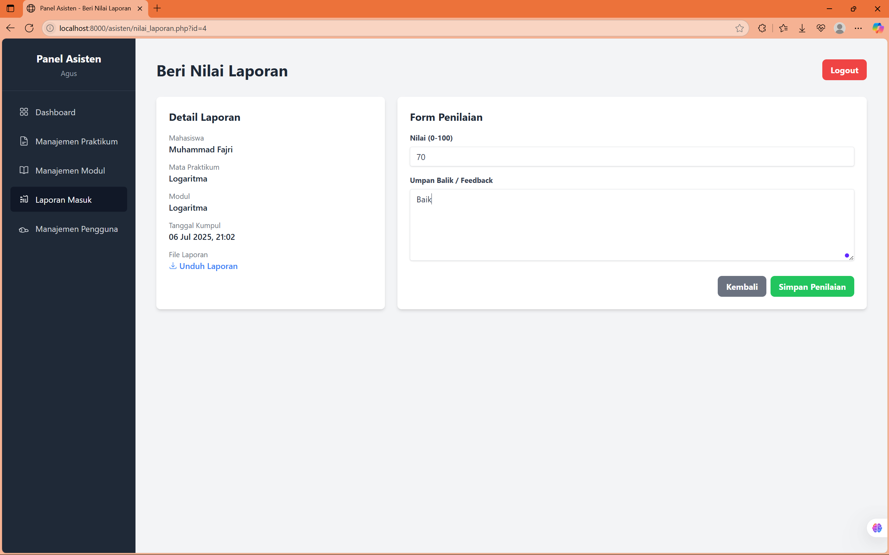
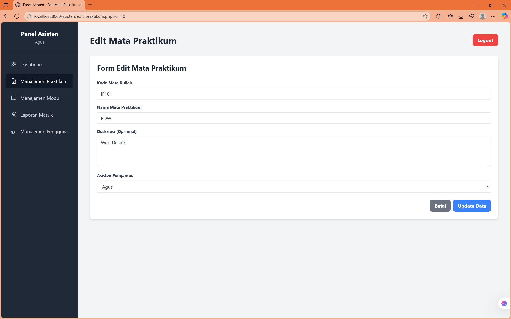

# 20230140189_UAS_PDW

# 📄 Aplikasi Sistem Pengumpulan Tugas

Proyek ini adalah aplikasi pengumpulan tugas berbasis web untuk mahasiswa dan asisten.

## 🖼️ Tampilan Antarmuka (UI Screenshots)

### 🔐 Login dan Registrasi

### 👨‍🎓 Dashboard Mahasiswa

### 🧑‍🏫 Dashboard Asisten

### 📥 Pengumpulan & Penilaian

### 📋 Modul & Praktikum

### 📅 Katalog Praktikum

### 👥 Manajemen Pengguna

### 🧾 Laporan

### 👨‍💻 Praktikum Saya

